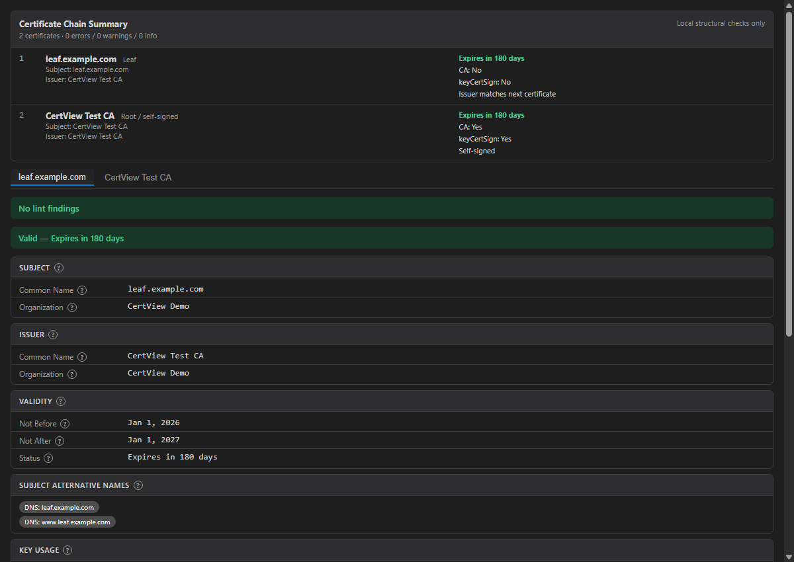

# CertView: X.509 Certificate Utility

**Inspect certificates without leaving VS Code.**
CertView helps you quickly answer who issued a certificate, when it expires, which names it covers, whether a chain is ordered as expected, and what fingerprints you need to copy for reviews or incidents.

It works offline, does not include telemetry, and does not send certificate, key, or PKI material outside your machine. No external tools, OpenSSL install, account, or network access required.

## Install

- Install from the [VS Code Marketplace](https://marketplace.visualstudio.com/items?itemName=gmm.certview).
- Or search for **X509 Certificate Utility** in the VS Code Extensions view.
- Open any supported certificate file to inspect it directly in the editor.

## What it does

Double-click any certificate file and instantly see:

- **Subject & Issuer** — Common Name, Organization, Country, and more
- **Validity period** — clear expiry date with a visual status banner (valid / expiring soon / expired)
- **Fingerprints** — certificate SHA-1/SHA-256 and key SPKI SHA-1/SHA-256 with one-click copy
- **Public key** — algorithm with key size or curve, such as `RSA-4096` or `EC-P-256`
- **Key parameters** — RSA public exponent and EC named curve aliases where the runtime exposes them
- **Extensions** — SANs, Key Usage, Extended Key Usage, Basic Constraints, Name Constraints, SCTs, and arbitrary critical or noncritical extensions
- **CSRs and CRLs** — CSR fingerprints, requested CSR SANs/extensions, CSR key fingerprints, and CRL issuer/update/signature metadata
- **Lint findings** — errors, warnings, and informational notices tied to RFC references
- **RFC tooltips** — hover over sections and fields for relevant RFC guidance
- **Local format coverage** — X.509 certificates, chains, CSRs, CRLs, PKCS#7 bundles, PKCS#12/PFX keystores, and public/private key files

## Expiry warnings at a glance

Never get caught by a surprise certificate expiration. Files expiring within 30 days get a yellow warning banner; expired certificates show a red one.

## Certificate chains

Multi-certificate files (chains, P7B bundles) are displayed as tabbed panels — one tab per certificate in the chain.

## CA certificates

Self-signed and CA certificates are clearly identified.

## Certificate Revocation Lists

CRL files open with issuer and update timestamps — no more decoding DER by hand.

## Supported formats

| Extension | Format |
| --- | --- |
| `.pem` | PEM — single certificate, certificate chain, public key, private key, or mixed certificate/key bundle |
| `.cer` `.crt` | DER or PEM certificate |
| `.der` | DER binary certificate, with DER SPKI/PKCS#8 key fallback |
| `.p7b` `.p7c` `.p7` | PKCS#7 certificate bundle |
| `.crl` | Certificate Revocation List |
| `.csr` | Certificate Signing Request (PKCS#10) |
| `.p12` `.pfx` | PKCS#12 keystore — password prompt if protected |
| `.key` `.pub` | PEM or DER public keys and unencrypted private keys, plus encrypted private-key detection without decryption prompts |
| `.jwk` | JSON Web Key public keys |

## Workspace scanning

The Certificates panel scans supported files in the current workspace. Large repositories can tune that scan without changing project files:

- `certview.workspace.maxFiles` limits how many certificate-related files the panel shows before adding a limit notice.
- `certview.workspace.excludeGlobs` adds VS Code glob patterns to skip generated or vendor folders, such as `**/dist/**`, `**/build/**`, or `**/vendor/**`.

VS Code glob patterns use `/` as the path separator, including on Windows.

## Usage

- **Open a file** → the viewer opens automatically on double-click
- **Right-click** any supported file → *CertView: Open Certificate*
- **Certificates panel** in the Explorer sidebar lists all cert files in the workspace
- **Hover** sections or fields in the certificate view to see RFC context
- **Hover or focus** the `?` indicator beside fields and sections to see RFC context inside the webview
- **Copy lint report** from the validation banner for JSON output suitable for issue comments or reviews

## Project status and collaboration

CertView is open to focused contributions in parsing, diagnostics, webview UX, test fixtures, documentation, and Marketplace presentation.

- See [ROADMAP.md](ROADMAP.md) for planned work and help-wanted areas.
- See [CONTRIBUTING.md](CONTRIBUTING.md) before opening a pull request.
- See [SECURITY.md](SECURITY.md) before reporting parser, rendering, denial-of-service, or secret-handling concerns.
- Please do not attach private keys, production certificates, customer certificates, tokens, passwords, or proprietary PKI material to public issues.

## Settings

| Setting | Default | Description |
| --- | --- | --- |
| `certview.warningDaysBeforeExpiry` | `30` | Days before expiry to show the warning banner |
| `certview.showExpiredWarning` | `true` | Highlight expired certificates |
| `certview.workspace.maxFiles` | `200` | Maximum certificate-related files shown in the Certificates panel before a limit notice appears |
| `certview.workspace.excludeGlobs` | `[]` | Extra VS Code glob patterns to skip during Certificates panel scans |

## Requirements

- VS Code 1.85 or later
- Maintainer guidance for VS Code and Node baseline changes is documented in [CONTRIBUTING.md](CONTRIBUTING.md#compatibility-policy)
- Works fully offline — no network access, no telemetry
- Files larger than 5 MiB are refused before parsing to protect the VS Code extension host from unbounded certificate, PKCS#7, or PKCS#12 processing

## Security and validation notes

- The viewer performs offline structural and profile lint checks for validity dates, CA/key usage consistency, SAN presence and criticality, extension criticality, and unrecognized extensions.
- Multi-certificate files are checked for issuer/subject ordering, CA marking, keyCertSign usage, validity nesting, and path length constraints. These checks are not full RFC 5280 certification path validation.
- Critical and noncritical X.509 v3 extensions are shown with OID, display name, and decoded or hexadecimal value where available. The local OID registry includes common X.520/RDN, PKCS #9, EKU, CA/B Forum policy, public-key algorithm, named-curve, Brainpool, SM2, Microsoft, and Certificate Transparency OIDs. Well-formed Certificate Transparency SCT lists are decoded into SCT entries with version, known log name, log ID, timestamp, and signature algorithm; malformed SCT values fall back to raw DER. The built-in CT log names cover current and recent Google CT log list v3 entries for major operators, including Google, Cloudflare, DigiCert, Sectigo, Let's Encrypt, TrustAsia, Geomys, and IPng Networks.
- CSR parsing extracts subject fields, CSR fingerprints, requested subjectAltName entries, requested extension names, public-key metadata, public-key PEM, and SPKI fingerprints where supported by the runtime.
- CRL parsing extracts issuer, thisUpdate, nextUpdate, revoked-entry count, signature algorithm, selected CRL extensions, and CRL fingerprints.
- Mixed PEM files that contain both certificate and key blocks are shown as a bundle instead of dropping key blocks.
- Public and private key views include SHA-1 and SHA-256 fingerprints over the DER-encoded SubjectPublicKeyInfo.
- Newer algorithms such as ML-DSA depend on the VS Code extension host's Node.js and OpenSSL support.
- Algorithm support is runtime-dependent. CertView displays algorithms that Node.js can parse from X.509 SubjectPublicKeyInfo, PKCS#8, SPKI, or JWK inputs. RSA, RSA-PSS, EC, Ed25519, Ed448, and runtime-supported ML-DSA keys are covered by tests or guarded runtime checks. ML-KEM support depends on the extension host's Node.js/OpenSSL key import support and is not guaranteed on older runtimes.
- Encrypted private keys are detected but not decrypted; CertView does not prompt for private-key passwords.
- Lint findings are advisory. They do not establish certificate trust, revocation status, WebPKI compliance, RFC 5280 path validation, FIPS compliance, Common Criteria conformance, or organizational policy compliance.

## Release Notes

### 0.3.5

- Hardened certificate, PKCS#7, PKCS#12, PEM, DER, CSR, CRL, and key parsing paths with explicit input and PEM block limits to reduce extension-host DoS risk.
- Expanded X.509 extension decoding, advisory lint findings, chain-structure checks, Certificate Transparency SCT display, and RFC/NIST/ISO field help in the webview.
- Added native VS Code Problems diagnostics for certificate lint findings.
- Added PEM, DER, JWK, public-key, private-key, mixed certificate/key bundle, encrypted private-key metadata, and runtime-dependent ML-DSA key handling.
- Improved CSR and CRL detail extraction, including public-key metadata, SPKI fingerprints, CRL timing fields, selected CRL extensions, and fingerprints.
- Clarified PKCS#12 handling in the tree view: `.p12` and `.pfx` files may require an interactive password prompt, so the tree shows an informational item and the editor view performs the actual inspection.
- Kept dependency management on pnpm, removed the duplicate npm lockfile, and pinned CI to `pnpm@9.15.9` for reproducible release builds.

### 0.3.4

- Added certificate lint findings in the viewer and native VS Code Problems diagnostics
- Added broader X.509 extension decoding, chain checks, and path length validation
- Added PEM, DER, JWK, and runtime-dependent ML-DSA key viewing support
- Detects encrypted private keys without password prompts or decryption
- Hardened parsing with input limits and safer handling for newer certificate algorithms

### 0.3.1

- CI pipeline improvements and lint cleanup

### 0.3.0

- Added `.csr` support — Certificate Signing Request viewer
- Added `.p12` / `.pfx` support — extracts certificates from PKCS#12 keystores with password prompt

### 0.1.4

- Initial release — local certificate viewing
